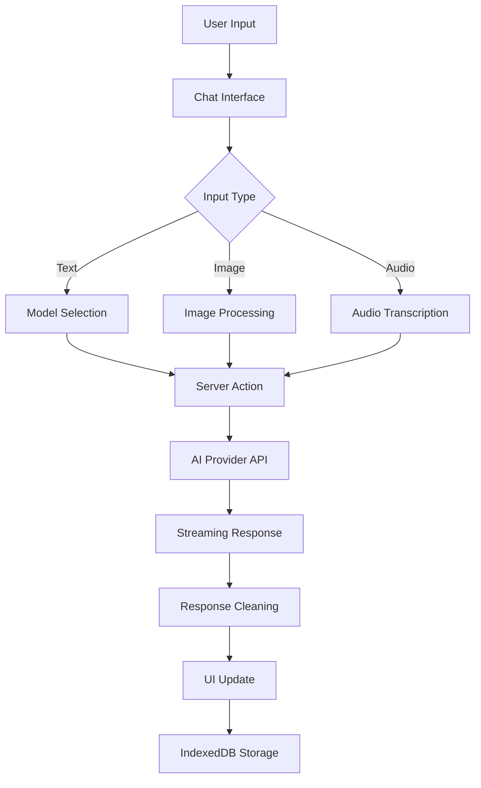

# 🚀 Rapid Chat

**Developer-first, privacy-focused multi-model AI chat interface**

Rapid Chat is a modern, streamlined AI chat application that puts privacy and developer experience first. Built with cutting-edge web technologies, it offers seamless switching between multiple AI providers while keeping all your data local.


---

## ✨ Why Rapid Chat?

- **🔒 Privacy-First**: All conversations stay on your device - no cloud storage, no tracking
- **⚡ Lightning Fast**: Real-time streaming responses with token-level performance metrics
- **🎯 Multi-Modal**: Support for text, images, PDFs, and audio transcription
- **🔧 Developer-Minded**: Built for builders with keyboard shortcuts, reasoning disclosure, and clean UI
- **🌐 Open Source**: 100% open source under Apache 2.0 - fork it, modify it, self-host it

## 🎯 Key Features

### 🔐 Privacy & Security
- **Zero Cloud Storage**: All conversations stay on your device
- **Local-First**: Uses IndexedDB for persistent chat history with automatic migration
- **No Data Tracking**: Your conversations never leave your browser
- **BYOK (Bring Your Own Key)**: Use your own API keys when self-hosting

### ⚡ Performance & UX
- **Real-time Streaming**: Token-by-token response streaming across all providers
- **Instant Model Switching**: Swap between AI models without page reloads
- **Optimized Architecture**: Built with Next.js 15, React 19, and Tailwind 4
- **Smart Response Processing**: Automatic content cleaning and reasoning extraction

### 📁 Multi-Modal Capabilities
- **Images**: PNG/JPEG/JPG upload, paste, and drag-drop (stored locally)
- **PDFs**: Upload documents up to 10MB with preview and download chips
- **Audio**: Desktop voice recording with transcription via Groq Distil-Whisper
- **File Persistence**: All media stored alongside conversations in IndexedDB

### 🎛️ Developer Experience
- **Reasoning Disclosure**: Toggle view for models that emit `<think>` blocks
- **Performance Metrics**: Real-time token count and tokens/second monitoring
- **Keyboard Shortcuts**: Shift+Esc to focus input, Ctrl+Shift+Backspace to delete chat
- **Code-Friendly**: Syntax highlighting, one-click copy, KaTeX/LaTeX support
- **Clean UI**: Markdown rendering with GitHub Flavored Markdown support

## 🤖 Supported AI Models

Rapid Chat integrates with multiple AI providers to give you access to the best models for different tasks:

| Model | Provider | Images | PDFs | Specialty |
|-------|----------|--------|------|-----------|
| **Gemini Flash 2.5 Lite** | Google AI | ✅ | ❌ | Fast, concise multimodal responses |
| **Gemini Flash 2.0** | Google AI | ✅ | ✅ | Advanced multimodal with PDF support |
| **Llama Scout** | Groq | ✅ | ❌ | Reliable, fact-focused assistance |
| **Qwen 32B** | Groq | ❌ | ❌ | Deep reasoning and complex logic |
| **Devstral Small** | OpenRouter | ❌ | ❌ | Code-focused development assistant |
| **Deepseek R1** | OpenRouter | ❌ | ❌ | Advanced reasoning capabilities |
| **GPT-OSS 20B** | Groq/OpenRouter | ❌ | ❌ | Conversational and helpful |
| **Dolphin Mistral** | OpenRouter | ❌ | ❌ | Broad knowledge coverage |

> **Note**: Model availability is dynamically configured. Additional models can be found in `src/models/index.ts` but may not be exposed in the UI selector by default.

## 🚀 Quick Start

### Prerequisites

Before you begin, ensure you have:
- **Node.js 18+** installed on your system
- **npm** or **Bun** package manager
- API keys for the AI providers you want to use (optional for testing)

### Installation

1. **Clone the repository**
   ```bash
   git clone https://github.com/real-zephex/Rapid-Chat.git
   cd Rapid-Chat
   ```

2. **Install dependencies**
   ```bash
   # Using npm
   npm install
   
   # Or using Bun (recommended for faster installs)
   bun install
   ```

3. **Configure environment variables**
   
   Create a `.env.local` file in the root directory:
   ```env
   # Google AI (for Gemini models)
   GEMINI_API_KEY=your_google_ai_api_key
   
   # Groq (for Llama, Qwen, Whisper models)
   GROQ_API_KEY=your_groq_api_key
   
   # OpenRouter (for Deepseek, Devstral, etc.)
   OPENROUTER_API_KEY=your_openrouter_api_key
   
   # OpenAI (optional)
   OPENAI_API_KEY=your_openai_api_key
   ```

4. **Start the development server**
   ```bash
   # Using npm
   npm run dev
   
   # Or using Bun
   bun run dev
   ```

5. **Open your browser**
   
   Navigate to `http://localhost:3000` and start chatting!

### Production Deployment

For production deployment:

```bash
# Build the application
npm run build  # or bun run build

# Start the production server
npm start      # or bun run start
```

> **Tip**: You can start using Rapid Chat immediately without API keys - the interface will guide you through the setup process.

## 📖 How to Use

### Starting Your First Conversation

1. **Launch the app** - Open your browser and navigate to `http://localhost:3000`
2. **Click "Get Started"** - Use the homepage button or sidebar navigation
3. **Select an AI model** - Choose from the dropdown based on your needs:
   - 🖼️ **Images/PDFs**: Use Gemini Flash models or Llama Scout
   - 🧠 **Deep reasoning**: Try Qwen 32B or Deepseek R1
   - 💻 **Coding help**: Use Devstral for development tasks
   - 💬 **General chat**: GPT-OSS or Llama Scout work great
4. **Start chatting** - Type your message and press Enter

### Working with Media

#### Images
- **Upload**: Click the attachment icon or drag & drop images
- **Paste**: Copy an image and paste directly into the chat
- **Supported formats**: PNG, JPEG, JPG (up to 10MB each, 5 files max)
- **Privacy**: All images are stored locally in your browser

#### PDFs
- **Upload**: Select PDF files up to 10MB
- **Compatibility**: Currently supported with Gemini Flash models
- **Features**: Preview thumbnails and downloadable chips in the UI

#### Audio Transcription (Desktop Only)
- **Record**: Click the microphone icon to start recording
- **Duration**: 2 seconds minimum, 5 minutes maximum
- **Processing**: Automatic transcription via Groq Distil-Whisper
- **Edit**: Review and edit transcriptions before sending

### Advanced Features

#### Reasoning View
- **Toggle**: Click the reasoning button to see model's thought process
- **Supported models**: Works with models that emit `<think>` blocks
- **Use case**: Great for understanding complex problem-solving

#### Performance Metrics
- **Token counting**: See real-time token usage
- **Speed monitoring**: Track tokens per second (TPS)
- **Optimization**: Helps you choose the right model for your needs

#### Keyboard Shortcuts
- **Shift + Esc**: Focus the input field
- **Ctrl + Shift + Backspace**: Delete current chat
- **Standard shortcuts**: Copy, paste, select all work as expected

#### Chat Management
- **Multiple chats**: Open multiple conversations simultaneously
- **Organization**: Use the sidebar to navigate between chats
- **Deletion**: Remove chats you no longer need
- **Persistence**: All chats are automatically saved locally

## 🏗️ Architecture Overview

Rapid Chat is built with a modern, scalable architecture that prioritizes performance, privacy, and developer experience.

### Tech Stack

#### Frontend Framework
- **Next.js 15.4.6** - App Router with Server Actions for seamless API integration
- **React 19.1** - Latest concurrent features for optimal performance
- **TypeScript 5.9** - Strict typing for robust development
- **Tailwind CSS 4** - Utility-first styling with custom dark theme

#### AI Integration
- **@google/genai** - Google AI SDK for Gemini models
- **groq-sdk** - Fast inference for Llama, Qwen, and Whisper models
- **openai** - OpenAI SDK (used with OpenRouter for multiple providers)
- **Server Actions** - Secure, server-side AI model calls with streaming

#### Storage & Performance
- **IndexedDB** - Browser-native storage for chats and media
- **Automatic Migration** - Seamless upgrade from localStorage
- **Streaming Responses** - Real-time token-by-token UI updates
- **Local-First** - All data stays on your device

#### UI Enhancements
- **react-markdown** - GitHub Flavored Markdown rendering
- **KaTeX** - Mathematical notation support
- **react-hotkeys-hook** - Keyboard shortcuts
- **Syntax highlighting** - Code block highlighting with copy functionality

### Project Structure

```
src/
├── app/                    # Next.js App Router
│   ├── chat/[id]/         # Dynamic chat routes
│   ├── globals.css        # Global styles and dark theme
│   ├── layout.tsx         # Root layout with providers
│   └── page.tsx           # Homepage
│
├── models/                # AI model integrations
│   ├── google/            # Google AI (Gemini Flash, Gemma)
│   ├── groq/              # Groq models (Scout, Qwen, Whisper)
│   ├── openai/            # OpenAI models (optional)
│   ├── openrouter/        # OpenRouter providers
│   ├── handler/           # Model request handling
│   ├── database/          # Model configuration management
│   ├── index.ts           # Main model provider with streaming
│   └── types.ts           # TypeScript interfaces
│
├── ui/                    # React components
│   ├── chat-interface.tsx # Main chat UI with media support
│   ├── sidebar.tsx        # Navigation and chat management
│   ├── chat-components/   # Specialized chat components
│   │   ├── MessageComponent.tsx
│   │   ├── TokenCounter.tsx
│   │   └── ReasoningView.tsx
│   ├── get-started.tsx    # Landing page
│   └── main-content.tsx   # Content wrapper
│
├── utils/                 # Utility functions
│   ├── indexedDB.ts       # Storage management
│   ├── model-list.ts      # Available models configuration
│   ├── responseCleaner.tsx # AI response processing
│   └── wikiepedia_titles_ranker.ts
│
├── context/               # React contexts
│   └── SidebarContext.tsx # Sidebar state management
│
└── archives/              # Legacy/archive components
    └── page.tsx           # Archive landing page
```

### Data Flow



### Storage Architecture

#### IndexedDB Stores
- **`chats`**: Conversation data with embedded media files
- **`tabs`**: Active chat sessions for navigation
- **Migration**: Automatic upgrade from localStorage to IndexedDB

#### Message Structure
```typescript
interface Messages {
  role: "user" | "assistant";
  content: string;
  images?: { mimeType: string; data: Uint8Array }[];
  reasoning?: string;
  startTime?: number;
  endTime?: number;
}
```

### Security & Privacy

#### Data Protection
- **No Server Storage**: All conversations stored locally in IndexedDB
- **No Analytics**: Zero tracking or usage monitoring
- **Local Media**: Images and files never leave your device
- **API Key Security**: Keys handled securely via environment variables

#### Browser Compatibility
- **IndexedDB**: Modern browsers (Chrome 24+, Firefox 16+, Safari 7+)
- **Web Streams**: Real-time streaming support
- **Media APIs**: Audio recording and file handling
- **Service Workers**: Offline capability (planned)

## 🚀 Development

### Development Scripts

```bash
# Development with Turbopack (faster builds)
npm run dev        # or bun run dev

# Production build
npm run build      # or bun run build

# Start production server
npm run start      # or bun run start

# Code linting
npm run lint       # or bun run lint
```

### Adding a New AI Model

Follow these steps to integrate a new AI model:

1. **Create the model generator**
   ```bash
   # Create file: src/models/<provider>/<model-name>.ts
   ```

2. **Implement the generator function**
   ```typescript
   import { incomingData } from "../types";
   
   async function* YourModel({ inc }: { inc: incomingData }) {
     // Configure model parameters
     const config = {
       model: "your-model-name",
       max_tokens: 8192,
       temperature: 0.7,
       // ... other settings
     };
     
     // Process incoming data
     const messages = inc.chats.map(chat => ({
       role: chat.role,
       content: chat.content
     }));
     
     // Stream response
     for await (const chunk of modelResponse) {
       yield chunk.content || "";
     }
   }
   
   export default YourModel;
   ```

3. **Register in model index**
   ```typescript
   // In src/models/index.ts
   import YourModel from "./provider/your-model";
   
   // Add to model mappings
   const modelMappings = {
     // ... existing models
     "your-model-code": YourModel,
   };
   ```

4. **Expose in model list**
   ```typescript
   // In src/utils/model-list.ts or database configuration
   {
     name: "Your Model Name",
     code: "your-model-code", 
     image: false, // or true if supports images
     pdf: false,   // or true if supports PDFs
     description: "Brief description of model capabilities",
     type: "conversational" // or "reasoning" or "general"
   }
   ```

5. **Optional: Customize prompts and UI**
   - Add model-specific system prompts
   - Configure UI hints and descriptions
   - Test across different input types

### Development Guidelines

#### Code Standards
- **TypeScript**: Use strict typing throughout
- **Server Actions**: Prefer small, focused server actions
- **Component Structure**: Keep components focused and reusable
- **Error Handling**: Implement graceful error handling and fallbacks

#### Model Integration Patterns
- **Co-location**: Keep model prompts with their generators
- **Streaming**: Reuse existing streaming patterns
- **Response Cleaning**: Use the response cleaner utility
- **Testing**: Test across providers and edge cases

#### Performance Best Practices
- **Lazy Loading**: Load models on demand
- **Caching**: Implement appropriate caching strategies
- **Streaming**: Use token-level streaming for responsiveness
- **Memory Management**: Clean up resources (object URLs, listeners)

### Project Conventions

#### File Organization
```
├── Components named with PascalCase
├── Files use kebab-case or camelCase consistently
├── Types defined in dedicated .ts files
├── Server actions in separate files
└── Utilities grouped by functionality
```

#### Git Workflow
```bash
# Create feature branch
git checkout -b feature/your-feature-name

# Make changes and commit
git add .
git commit -m "feat: descriptive commit message"

# Push and create PR
git push origin feature/your-feature-name
```

#### Testing
- Test new models with various input types
- Verify streaming responses work correctly
- Check error handling with invalid inputs
- Validate UI interactions and shortcuts

## 🤝 Contributing

We welcome contributions from the community! Whether you're fixing bugs, adding features, or improving documentation, your help makes Rapid Chat better for everyone.

### Quick Contributing Guide

1. **Fork the repository** on GitHub
2. **Clone your fork** locally
   ```bash
   git clone https://github.com/your-username/Rapid-Chat.git
   cd Rapid-Chat
   ```
3. **Create a feature branch**
   ```bash
   git checkout -b feature/amazing-new-feature
   ```
4. **Make your changes** and test thoroughly
5. **Commit your changes**
   ```bash
   git commit -m "feat: add amazing new feature"
   ```
6. **Push to your fork**
   ```bash
   git push origin feature/amazing-new-feature
   ```
7. **Open a Pull Request** with a clear description

### Development Setup

```bash
# Install dependencies
npm install  # or bun install

# Start development server
npm run dev  # or bun run dev

# Run linting
npm run lint  # or bun run lint

# Build for production
npm run build  # or bun run build
```

### Contribution Guidelines

#### Code Quality
- **TypeScript**: Use strict typing and interfaces
- **ESLint**: Follow the existing linting rules
- **Formatting**: Maintain consistent code formatting
- **Comments**: Add comments for complex logic

#### Pull Request Guidelines
- **Clear Description**: Explain what your PR does and why
- **Small Changes**: Keep PRs focused on a single feature/fix
- **Tests**: Include tests for new functionality when possible
- **Documentation**: Update README or docs if needed

#### Commit Message Format
Use conventional commits for clear history:
```
feat: add new AI model integration
fix: resolve streaming response issue
docs: update installation instructions
style: improve code formatting
refactor: simplify model selection logic
```

### Ways to Contribute

#### 🐛 Bug Reports
- Use GitHub Issues to report bugs
- Include steps to reproduce
- Provide browser/OS information
- Include screenshots if relevant

#### ✨ Feature Requests
- Check existing issues first
- Describe the use case clearly
- Explain why it would be valuable
- Consider implementation complexity

#### 🔧 Code Contributions
- **New AI Models**: Add support for additional providers
- **UI Improvements**: Enhance user experience
- **Performance**: Optimize streaming or storage
- **Accessibility**: Improve keyboard navigation and screen reader support

#### 📚 Documentation
- **README improvements**: Make setup clearer
- **Code comments**: Explain complex functions
- **Tutorials**: Create usage guides
- **API documentation**: Document model integration

### Community Guidelines

- **Be Respectful**: Treat all contributors with respect
- **Be Constructive**: Provide helpful feedback
- **Be Patient**: Allow time for review and discussion
- **Be Collaborative**: Work together to find the best solutions

### Getting Help

- **Issues**: Check existing GitHub issues
- **Discussions**: Use GitHub Discussions for questions
- **Contact**: Reach out to maintainers directly if needed

### Recognition

Contributors are recognized in:
- GitHub contributor graphs
- Release notes for significant contributions
- Special mentions for outstanding help

## 🚀 Deployment

### Self-Hosting Options

#### Vercel (Recommended)
```bash
# Install Vercel CLI
npm i -g vercel

# Deploy from repository root
vercel

# Set environment variables in Vercel dashboard
# GEMINI_API_KEY, GROQ_API_KEY, OPENROUTER_API_KEY, etc.
```

#### Netlify
```bash
# Build the application
npm run build

# Deploy the out/ directory to Netlify
# Set environment variables in Netlify dashboard
```

#### Docker (Self-Hosted)
```dockerfile
FROM node:18-alpine
WORKDIR /app
COPY package*.json ./
RUN npm install
COPY . .
RUN npm run build
EXPOSE 3000
CMD ["npm", "start"]
```

#### Manual Server Deployment
```bash
# On your server
git clone https://github.com/real-zephex/Rapid-Chat.git
cd Rapid-Chat
npm install
npm run build

# Configure environment variables
cp .env.example .env.local
# Edit .env.local with your API keys

# Start with PM2 or similar process manager
npm start
```

### Environment Variables

Required for full functionality:
```env
# Google AI (Gemini models)
GEMINI_API_KEY=your_google_ai_key

# Groq (Llama, Qwen, Whisper)
GROQ_API_KEY=your_groq_key

# OpenRouter (Multiple providers)
OPENROUTER_API_KEY=your_openrouter_key

# OpenAI (Optional)
OPENAI_API_KEY=your_openai_key
```

### Performance Optimization

#### Build Optimizations
- **Bundle Analysis**: Use `npm run build` to analyze bundle size
- **Image Optimization**: Next.js automatically optimizes images
- **Code Splitting**: Components are automatically split

#### Runtime Optimizations
- **Streaming**: Responses stream in real-time
- **Caching**: API responses are appropriately cached
- **Lazy Loading**: Models load on demand

---

## 🔧 Troubleshooting

### Common Issues

#### Build Failures
```bash
# Clear Next.js cache
rm -rf .next

# Reinstall dependencies
rm -rf node_modules package-lock.json
npm install

# Rebuild
npm run build
```

#### API Key Issues
- Verify API keys are correctly set in `.env.local`
- Check API key permissions and quotas
- Ensure API keys have necessary scopes

#### Storage Issues
- **Clear IndexedDB**: Use browser developer tools
- **Migration Problems**: Check browser console for errors
- **Quota Exceeded**: Clear old conversations or use incognito mode

#### Performance Issues
- **Slow Streaming**: Check internet connection and API provider status
- **Memory Usage**: Close unused tabs, clear old conversations
- **Build Performance**: Use `bun` instead of `npm` for faster builds

### Browser Compatibility

| Feature | Chrome | Firefox | Safari | Edge |
|---------|--------|---------|--------|------|
| IndexedDB | ✅ 24+ | ✅ 16+ | ✅ 7+ | ✅ 12+ |
| Web Streams | ✅ 32+ | ✅ 65+ | ✅ 10+ | ✅ 79+ |
| Media Recording | ✅ 25+ | ✅ 29+ | ✅ 11+ | ✅ 12+ |
| File API | ✅ 13+ | ✅ 3.6+ | ✅ 6+ | ✅ 10+ |

### Getting Help

1. **Check Issues**: Look for similar problems in GitHub Issues
2. **Browser Console**: Check for JavaScript errors
3. **Network Tab**: Verify API calls are working
4. **Create Issue**: If you can't resolve it, create a detailed issue

---

## 📄 License

This project is licensed under the **Apache License 2.0**.

```
Copyright 2025 Rapid Chat

Licensed under the Apache License, Version 2.0 (the "License");
you may not use this file except in compliance with the License.
You may obtain a copy of the License at

    http://www.apache.org/licenses/LICENSE-2.0

Unless required by applicable law or agreed to in writing, software
distributed under the License is distributed on an "AS IS" BASIS,
WITHOUT WARRANTIES OR CONDITIONS OF ANY KIND, either express or implied.
See the License for the specific language governing permissions and
limitations under the License.
```

### What This Means
- ✅ **Commercial Use**: Use in commercial projects
- ✅ **Modification**: Modify the source code
- ✅ **Distribution**: Distribute the software
- ✅ **Private Use**: Use privately
- ✅ **Patent Grant**: Patent protection for contributors

See the full license in the [`LICENSE`](LICENSE) file.

---

## 📞 Contact & Support

### Project Maintainer
- **Email**: [zephex@duck.com](mailto:zephex@duck.com)
- **GitHub**: [@real-zephex](https://github.com/real-zephex)

### Community & Support
- **Issues**: [GitHub Issues](https://github.com/real-zephex/Rapid-Chat/issues) for bug reports
- **Discussions**: [GitHub Discussions](https://github.com/real-zephex/Rapid-Chat/discussions) for questions
- **Feature Requests**: [GitHub Issues](https://github.com/real-zephex/Rapid-Chat/issues) with enhancement label

### Repository
- **GitHub**: [https://github.com/real-zephex/Rapid-Chat](https://github.com/real-zephex/Rapid-Chat)
- **License**: Apache 2.0
- **Latest Release**: Check [releases page](https://github.com/real-zephex/Rapid-Chat/releases)

---

## 🙏 Acknowledgments

Special thanks to:
- **Next.js Team** for the amazing framework
- **Vercel** for hosting and deployment tools
- **AI Providers** (Google, Groq, OpenRouter) for API access
- **Open Source Community** for libraries and tools
- **Contributors** who help improve Rapid Chat

---

<div align="center">

**Built with ❤️ for the developer community**

[⭐ Star on GitHub](https://github.com/real-zephex/Rapid-Chat) • [🐛 Report Bug](https://github.com/real-zephex/Rapid-Chat/issues) • [💡 Request Feature](https://github.com/real-zephex/Rapid-Chat/issues) • [🤝 Contribute](https://github.com/real-zephex/Rapid-Chat/blob/main/README.md#-contributing)

</div>
